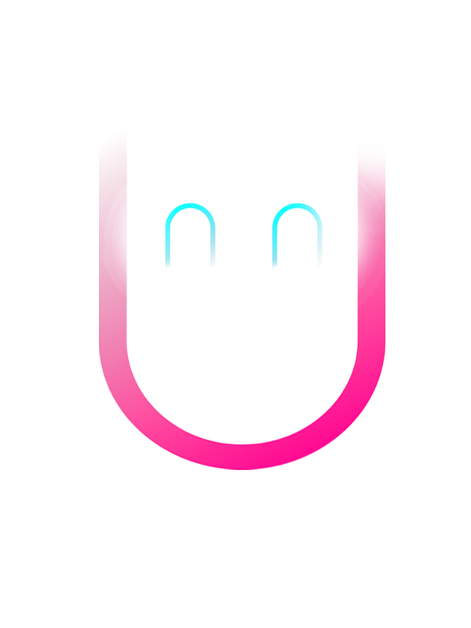

# JavaScript Code Explanation
## Currently Non-functional

This explanation covers two JavaScript files, `Star.js` and `Sketch.js`, which are part of a p5.js project. The project creates a dynamic starfield animation, where the stars' movement and appearance are influenced by the mouse position and frame rate.

## Star.js

### Global Variable

```javascript
let fps;
```

- `fps`: A global variable to hold the frame rate.

### Star Function

```javascript
function Star() {
  this.x = random(-width, width);
  this.y = random(-height, height);
  this.z = random(width);
  this.pz = this.z;
  ...
}
```

- The `Star` function acts as a constructor for creating star objects.
- `this.x`, `this.y`, and `this.z`: These properties define the 3D position of a star. They are initialized with random values.
- `this.pz`: Previous Z-coordinate of the star, initially set to the same value as `this.z`.

#### update Method

```javascript
this.update = function () {
  ...
};
```

- The `update` method adjusts the star's position.
- Decreases `this.z` by `speed`, simulating movement towards the viewer.
- If `this.z` exceeds a certain limit or goes below 1, the star's position is reset to create a continuous flow of stars.

#### show Method

```javascript
this.show = function () {
  ...
  fps = frameRate();
};
```

- The `show` method renders the star and its trail.
- Calculates screen position (`sx`, `sy`) from 3D coordinates.
- Draws an ellipse and a line for each star to create a visual effect.
- Updates the global `fps` variable with the current frame rate.

## Sketch.js

### Global Variables and Setup

```javascript
var stars = [];
var speed;
numOfStars = 2500;

function setup() {
  ...
}
```

- `stars`: An array to hold star objects.
- `speed`: A variable to control the movement speed of stars.
- `numOfStars`: Number of stars to be generated.
- The `setup` function initializes the canvas and creates star objects.

### Draw Function

```javascript
function draw() {
  ...
}
```

- The `draw` function is continuously executed.
- Updates `speed` based on the mouse's X position.
- Clears the canvas and repositions the drawing context to the center.
- Calls the `update` and `show` methods of each star.
- Displays the frame rate on the canvas.

This code collectively creates an interactive starfield animation where the speed and density of stars can change dynamically, and the frame rate is displayed on the screen.

### Getting Started

To run the Sand Simulator, you can do any one of the following:

1. Simply open the `/public/index.html` file in a modern web browser. The application is entirely client-side, requiring no additional installation or server setup. (No Sound effects)
2. Open terminal inside the folder and run this command: npm start followed by ctrl + clicking http://localhost:3000

### Acknowledgments

- Special thanks to The Coding Train for guidance and inspiration in creating this simulator.


